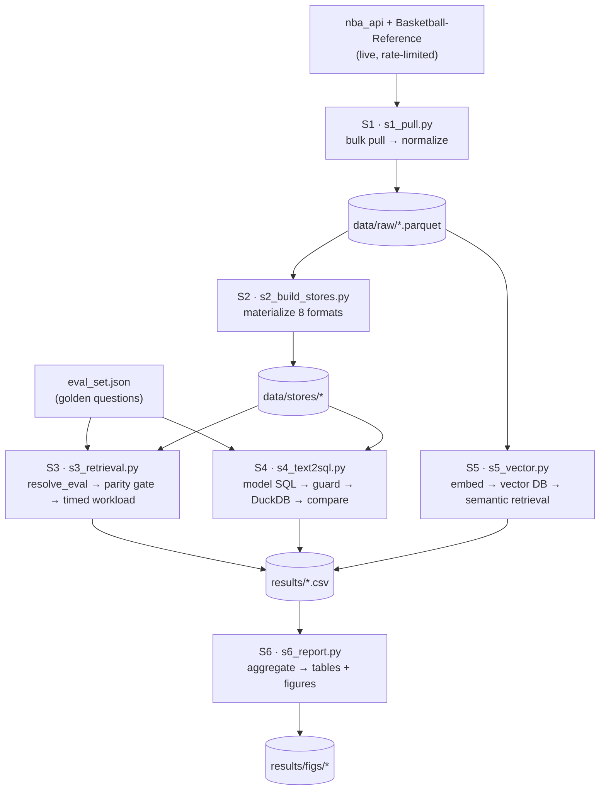
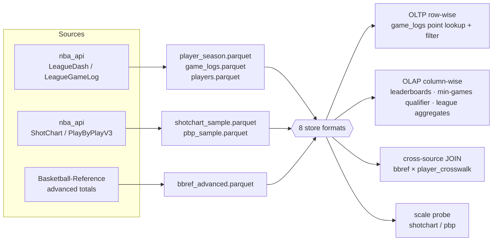
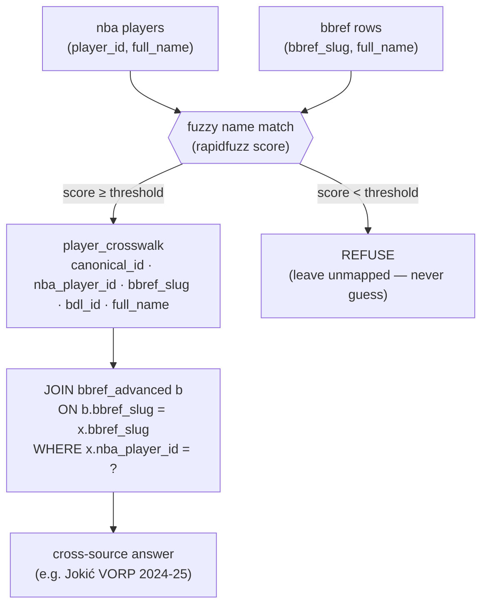
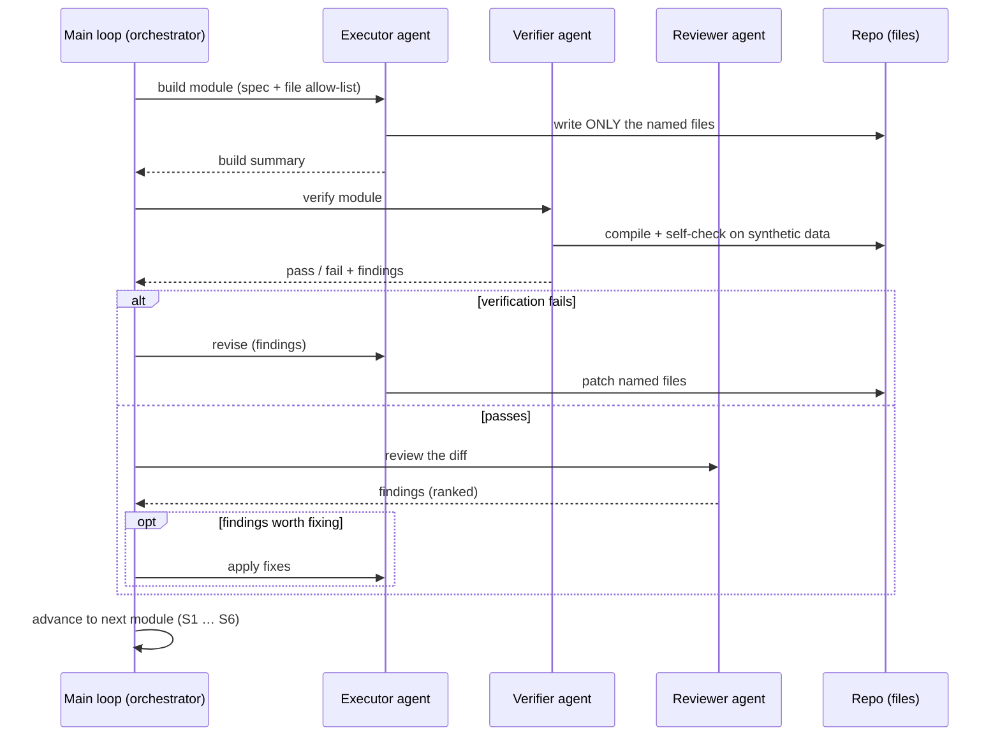
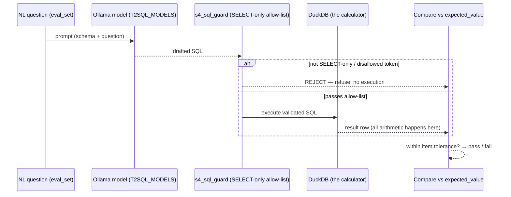

# v1 — Architecture

Five views of the experiment: the end-to-end pipeline, the data path, the cross-source id crosswalk,
the multi-agent build loop that produced it, and the guarded text-to-SQL flow. Each diagram is
followed by a short "logic and flow" note.

## 1. End-to-end pipeline (S1 → S6)

**Logic and flow:** Data enters once through S1, the only stateful, rate-limited stage, and is
frozen as normalized Parquet in `data/raw/`. Everything downstream reads that cache — never the live
API. S2 fans the raw tables out into every candidate storage format; S3/S4/S5 are independent
evaluation stages that each consume the stores (and the golden `eval_set.json`) and emit metrics
CSVs. S6 is a pure reducer: it reads only `results/*.csv` and renders the final tables and figures.
The strict left-to-right dependency means any stage can be re-run in isolation once its inputs exist.

## 2. Data sources → raw Parquet → stores → query routing

**Logic and flow:** Three source families collapse into a handful of normalized Parquet tables with
stable, `src/statlas`-compatible schemas (`game_logs` columns are kept byte-stable). S2 replicates
those tables into each of the eight formats — `csv`, `parquet_single`, `parquet_partitioned`,
`feather`, `duckdb`, `sqlite` (+index), `polars_mem`, `lancedb`. Every store then answers the same
four workload classes, so latency differences are attributable to the format, not the query. The
row-wise (OLTP) and column-wise (OLAP) split is the axis most likely to separate a B-tree row store
(sqlite) from a columnar engine (duckdb/parquet).

## 3. The id crosswalk join (nba_player_id ↔ bbref_slug)

**Logic and flow:** Basketball-Reference keys players by `bbref_slug`; nba_api keys them by integer
`player_id`. To answer a question like "Jokić's VORP" — a metric only BBRef provides — the two
sources must be bridged. A fuzzy full-name match (rapidfuzz) proposes pairings; only pairings at or
above the score threshold are written into `player_crosswalk`, and anything below is **refused**
(left unmapped) rather than guessed, honoring the repo's refuse-rather-than-guess rule. Queries then
join through the crosswalk on `bbref_slug`, filtered by the caller's `nba_player_id`, so an unmatched
player simply yields no row instead of a wrong number.

## 4. Multi-agent build / verify / review loop

**Logic and flow:** The experiment is assembled by an orchestrator that dispatches one **build
module** at a time, each with a tight spec and an explicit allow-list of files (so agents never
collide on ownership). An executor writes only its named files and reports back; a verifier
compile-checks and exercises pure functions on tiny synthetic frames (never the live API or full
data); a reviewer inspects the diff and ranks findings. Failures loop back to the same executor for a
revision before the orchestrator advances. This is why each stage is small, single-file, and imports
shared contracts from `config.py`/`_harness.py` rather than duplicating them.

## 5. Guarded text-to-SQL flow

**Logic and flow:** A natural-language eval question is handed to a local open-weight model with the
table schemas; the model returns candidate SQL and nothing else. That SQL never runs blindly — it
first passes `s4_sql_guard`, which enforces SELECT-only queries against an allow-list of
tables/columns/aggregations; anything with a disallowed token (DDL/DML, multiple statements,
unknown columns) is rejected and scored as a refusal, no execution. Only validated SQL reaches
DuckDB, which performs every computation, and the returned scalar is compared to the item's resolved
`expected_value` under its exact `tolerance` (the two-tier policy — 1e-7 for exact-rational metrics,
0 for counts/strings). The model contributes language; the database remains the sole calculator.
