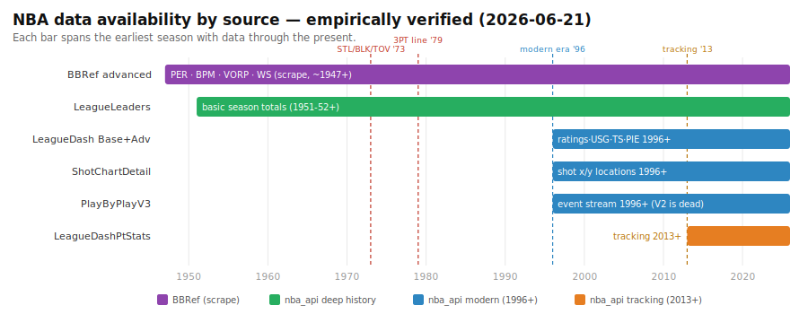
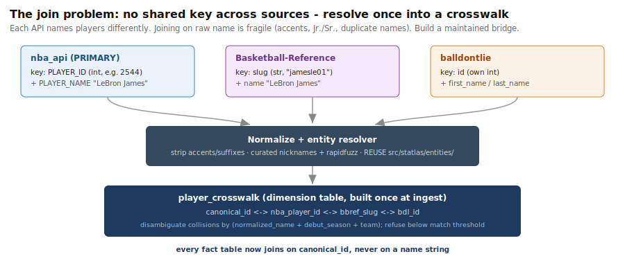
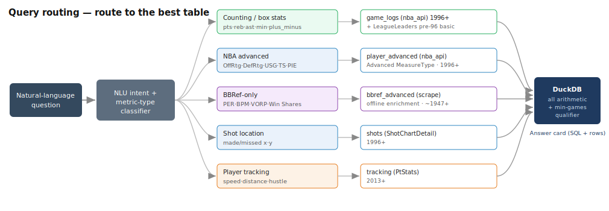

# NBA Data — EDA v2 Findings & Multi-Source Integration Plan

> **Source:** `notebooks/initial_eda_v2.ipynb` (run 2026-06-21, branch `data-exploration`). Every number
> below was produced by a **live** probe against the API today, not asserted from docs.
> **Audience:** the next working session — this is the hand-off that decides how Statlas stores and routes
> data across sources. Tie everything back to the canonical schema
> `game_logs(player_id, season, game_date, opponent_abbr, is_playoff, min, pts, reb, ast, plus_minus)`
> and the non-negotiables in `CLAUDE.md` (DuckDB does all arithmetic; refuse rather than guess; min-games qualifier on leaderboards).

---

## TL;DR (read this first)

1. **`nba_api` alone fully populates `game_logs` for 1996-97 → present, natively, with zero computation.** That era also has advanced stats, shot charts, and play-by-play. Make it the **primary** source.
2. **History is tiered, not flat.** Rich/advanced data starts **1996-97**; basic counting totals reach back to **1951-52**; player-tracking only **2013-14+**. The further back you go, the fewer metrics are even well-posed.
3. **Almost every advanced metric is native** (ratings, USG/TS/eFG, AST%/REB%, pace, four factors, **PIE**). The **only** gaps are **PER, BPM, VORP, Win Shares** — the NBA doesn't publish these; they're Basketball-Reference inventions.
4. **The integration question is real but bounded.** We need **at most two sources**: `nba_api` (everything modern + native advanced) and **Basketball-Reference** (the 4 derived metrics + pre-1996 depth). Everything else (balldontlie, hoopR, pbpstats, Kaggle) is optional/situational.
5. **Recommended architecture: route by metric, store in one DuckDB warehouse, join on a maintained `canonical_id` crosswalk — never on a raw player name.** Details in [§5](#5-how-to-combine-the-sources-three-options) and [§6](#6-recommendation).
6. **Operational gotcha baked into ingest:** the **V2** box-score / play-by-play endpoints are **deprecated and return empty** — use the **V3** variants.

---

## 1. How far back does each source go? (Q1)

| Endpoint | Earliest season (verified) | How verified in the notebook |
|---|---|---|
| `LeagueDashPlayerStats` — **Base** | **1996-97** | binary search; 1995-96 returns 0 rows (empty, not error) |
| `LeagueDashPlayerStats` — **Advanced** | **1996-97** | binary search; 79-col frame at 1996-97, empty before |
| `LeagueLeaders` (basic totals) | **1951-52** | binary search; 1950-51 & earlier return 0 rows |
| `LeagueDashPtStats` (tracking) | **2013-14** | binary search; 2012-13 returns 0 (no tracking cameras) |
| `ShotChartDetail` | **1996-97** | bracket; 1996-97 = 106,496 league-wide shots, 1995-96 = 0 |
| `PlayByPlayV3` | **1996-97** | bracket; 1996-97 game = 482 events, 2023-24 = 455 |

**Column-survival within `LeagueLeaders`** (fixed schema, but stats phase in): steals/blocks/turnovers begin **1973-74**, the 3-point line **1979-80**. So "data exists for 1965" ≠ "you can ask about steals in 1965" — the resolver must refuse metrics that didn't exist yet.

> **Correction to prior research:** `LeagueLeaders` reaches **1951-52**, materially deeper than the "~1979-80" hypothesis. The 1979-80 figure is roughly where *3-point* data begins, not where the endpoint begins.

---

## 2. Native vs. derived advanced metrics (Q2)

| Metric | Verdict | Where it comes from |
|---|---|---|
| Plus/Minus | **native** | `PLUS_MINUS` in Base box score — *already a `game_logs` column* |
| Off / Def / Net Rating | **native** | Advanced `MeasureType`, `BoxScoreAdvancedV3` |
| Usage % (USG%) | **native** | Advanced `MeasureType` |
| True Shooting (TS%), eFG% | **native** | Advanced `MeasureType` |
| AST% / REB% | **native** | Advanced `MeasureType` |
| Pace / Possessions | **native** | Advanced `MeasureType` (`PACE`, `POSS`) |
| Four Factors | **native** | `BoxScoreFourFactorsV3` |
| **PIE** | **native** | Advanced `MeasureType` — NBA's all-in-one metric |
| **PER** | **derived** | ❌ not NBA-provided → Basketball-Reference |
| **BPM** | **derived** | ❌ not NBA-provided → Basketball-Reference |
| **VORP** | **derived** | ❌ not NBA-provided → Basketball-Reference |
| **Win Shares** | **derived** | ❌ not NBA-provided → Basketball-Reference |

**Key nuance:** "native" means we *ingest a column* — it does **not** mean the model computes anything. Per the architecture, **DuckDB still performs every aggregation, average, and min-games filter at query time.** "Derived" here means the NBA's raw inputs exist but the composite isn't NBA-served, so we'd either compute it (extra surface area / risk) or pull it pre-computed from Basketball-Reference. **Recommendation: pull, don't recompute** — BBRef's formulas are the reference implementations and recomputing invites subtle disagreement with what users expect.

---

## 3. Source catalog (Q3)

| Source | Adds | Restrictions | Verdict |
|---|---|---|---|
| **nba_api** | native advanced + tracking + shot/PBP, 1996-97→ | unofficial; rate-limits bursts; **V2 endpoints dead** | **Primary** |
| **Basketball-Reference** (`basketball_reference_web_scraper`) | **PER/BPM/VORP/WS**; history to 1940s | scraping: fragile to HTML, ~20 req/min, ToS-sensitive | **Adopt as offline complement** |
| **balldontlie** | clean JSON games/players/box | **free key required**; no advanced/tracking | prototyping only |
| **pbpstats** | possession-level, lineup & on/off | smaller project | situational (lineup data) |
| **shufinskiy/nba_data** | bulk PBP + shot detail dumps (1996-97→) | static; you manage refresh | good for bulk backfill |
| **hoopR** | ESPN + NBA incl. PBP | **R-first** | skip (wrong language) |
| **Kaggle NBA datasets** | static historical CSVs | frozen / stale | offline experiments |

Live-demo evidence from the notebook: BBRef returned **654 players** of 2024-25 advanced totals (Jokić led VORP at 9.8) — exactly the four metrics `nba_api` lacks. balldontlie self-skipped (no key set), confirming the graceful-degradation path works.

---

## 4. Does this populate `game_logs`?

**Yes — entirely from `nba_api`, natively, 1996-97 → present.** `game_logs` is game-level, so rows come from game-level endpoints (`PlayerGameLog`, `LeagueGameFinder`, `BoxScore*V3`):

| `game_logs` column | Source field |
|---|---|
| `player_id` | `PLAYER_ID` |
| `season` | query param / `SEASON_ID` |
| `game_date` | `GAME_DATE` |
| `opponent_abbr` | parse from `MATCHUP` |
| `is_playoff` | `season_type_all_star='Playoffs'` flag |
| `min` / `pts` / `reb` / `ast` / `plus_minus` | `MIN` / `PTS` / `REB` / `AST` / `PLUS_MINUS` |

No second source is needed to fill the core schema. BBRef only matters when a question asks for PER/BPM/VORP/WS or pre-1996 history.

---

## 5. How to combine the sources — three options

The crux: **the sources share no common key.** `nba_api` keys on `PLAYER_ID` (int), BBRef on a `slug` string (`jamesle01`), balldontlie on its own `id`. The only overlapping field is the **player name**, and joining on raw names is fragile — accents (`Jokić` vs `Jokic`), suffixes (`Jaren Jackson Jr.`), and genuine duplicates (multiple `Mike Dunleavy`).

### Option A — Pure routing, no joins
Classify the query's metric type, send it to the **single** best source, return that source's answer. Never join across sources.
- ✅ Simplest; sidesteps the key problem entirely; matches the existing rule-based planner.
- ❌ Can't answer a question that needs fields from two sources in one row (rare: e.g. "show me his USG% *and* VORP together"). Cross-source comparisons must be done as two separate lookups.

### Option B — Routing + join via a crosswalk dimension
Same routing, but maintain a `player_crosswalk` table (`canonical_id ⇄ nba_player_id ⇄ bbref_slug ⇄ bdl_id`). When a query needs columns from two sources, join their fact tables **on `canonical_id`**, resolved once at ingest by the **existing entity resolver** (`src/statlas/entities/`, rapidfuzz + curated nicknames), disambiguating collisions with `(normalized_name + debut_season + team)`.
- ✅ Enables cross-source rows; join key is a clean int, not a string; reuses code we already have.
- ❌ One more table to build and keep fresh; resolver must **refuse** below a match threshold (no silent wrong joins).

### Option C — Unified ETL warehouse (the end state)
Periodically ETL **all** sources into one DuckDB warehouse: resolve IDs at **ingest** time (write `canonical_id` onto every row as it lands), and store unified fact tables (`game_logs`, `player_advanced`, `bbref_advanced`, `shots`, `tracking`). At query time there's only **one** clean warehouse — routing is just "which table," and any join is a trivial `canonical_id` equality.
- ✅ Cleanest query path; the database stays the single calculator (true to the architecture); offline scraping never touches the request path; rate-limit/fragility risk is confined to the ETL job.
- ❌ Most up-front ETL work; needs a refresh cadence and a crosswalk-maintenance step.

---

## 6. Recommendation

**Adopt Option A now, design for Option C.** Concretely:

1. **`nba_api` is primary and self-sufficient** for the core `game_logs` schema and all NBA-native advanced metrics, 1996-97 → present. Build the warehouse on it first; this alone answers the vast majority of v1 questions.
2. **Route by metric type** (see diagram) — the planner already classifies intent; extend it to pick the table. Counting/box → `game_logs`; NBA advanced → `player_advanced`; shot location → `shots`; tracking → `tracking`.

   

3. **Add Basketball-Reference as an *offline enrichment job only*** — a scheduled ETL that scrapes PER/BPM/VORP/WS into a `bbref_advanced` table, **never** a request-path call (its fragility/rate-limits must not block a user query). This is the first piece of Option C.
4. **Build the `player_crosswalk` at ingest** (Option B/C mechanics) using the **existing `src/statlas/entities/` resolver** so BBRef rows carry `canonical_id = nba_player_id`. Joining BBRef↔nba_api then needs no name matching at query time. **Refuse to map** below the resolver's `min_score` — a wrong join is worse than "I don't know."
5. **Keep balldontlie / shufinskiy / pbpstats parked.** Revisit shufinskiy if we want bulk PBP/shot backfill, pbpstats if we add lineup/on-off questions. Skip hoopR (R) and treat Kaggle as offline-only.
6. **Every leaderboard keeps the min-games qualifier** regardless of source (the notebook used `games_played >= 40` on the BBRef demo). A 6-game sample must never win.

---

## 7. Risks & gotchas to carry forward

- **V2 endpoints are dead.** `PlayByPlayV2`, `BoxScoreAdvancedV2` return empty/KeyError. Use **V3**. Pin this in the ingest layer.
- **nba_api rate-limits bursts.** Keep the `time.sleep` between calls; consider caching responses during ETL. It's unofficial — expect occasional timeouts; wrap calls (the notebook's `safe_rows` pattern).
- **BBRef scraping is fragile.** HTML can change; ~20 req/min ceiling; ToS-sensitive. Confine to offline ETL, cache aggressively, and tolerate failure (the demo cell already degrades gracefully).
- **Name-join landmines.** Accents, `Jr./Sr./III`, and duplicate names. Always resolve to `canonical_id`; never join two sources on a name string.
- **History cliffs are real.** Don't let the engine answer a steals/3PT/tracking question for a season before that stat existed (1973-74 / 1979-80 / 2013-14) — refuse instead.
- **balldontlie needs a key.** Cells/code must no-op when `BALLDONTLIE_API_KEY` is unset.

---

## 8. Concrete next-session checklist

- [ ] Stand up a DuckDB warehouse builder that ingests `nba_api` game logs into the canonical `game_logs` schema (V3 endpoints), for a few recent seasons end-to-end.
- [ ] Add a `player_advanced` table from the Advanced `MeasureType` and wire metric-type routing in the planner.
- [ ] Prototype the `player_crosswalk` (nba ⇄ bbref) using `src/statlas/entities/`; measure resolver hit-rate and the unmatched tail; set a refuse threshold.
- [ ] Build the BBRef offline enrichment job → `bbref_advanced`, joined to nba_api on `canonical_id`; verify PER/BPM/VORP/WS land for a known player.
- [ ] Decide a refresh cadence for ETL + crosswalk (live season changes nightly; history is static).
- [ ] Extend the golden eval set with cross-source questions (e.g. "highest VORP" vs "highest PIE") to lock routing behavior.

---

*Visuals: `assets/data-availability-timeline.svg`, `assets/query-routing.svg`, `assets/id-crosswalk.svg`. Regenerate findings by re-running `notebooks/initial_eda_v2.ipynb` via `uv run --with jupyter jupyter nbconvert --execute`.*
